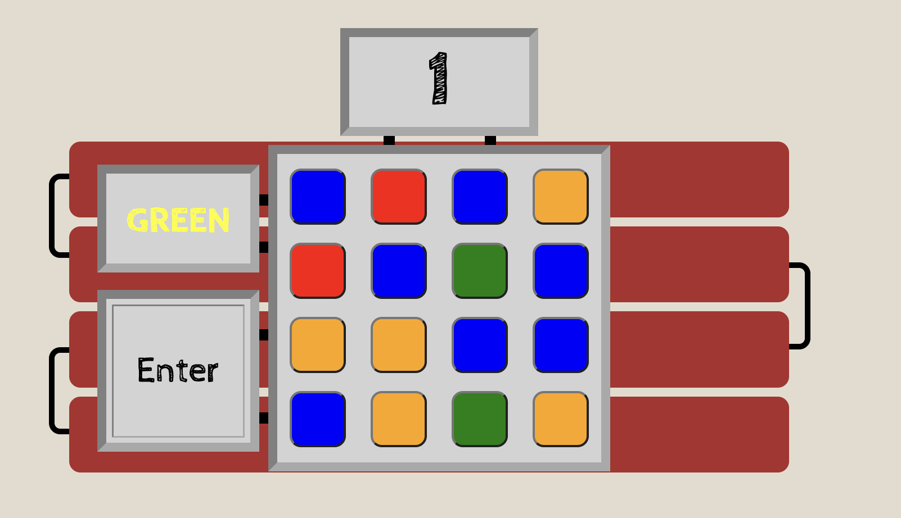

# Time Bomb

The idea behind the project Time bomb, was to create a game that had four aspects.  The aspect being a puzzle, in which the user clicks on each button generating a random color until none of the button's colors match the named color in the box.  The second aspect was the named color text itself.  The text names one color while its own text color is that of another.  The idea behind this was to create a brain teaser, that would throw off the user and potentially make the game more fun.  The fourth aspect was the multiple levels, which increased in dificultyThe final aspect was the timer, which added urgency for the user to complete the game.  I felt like this is what brought the game together, creating both a frustrating and better experience for the user.

This game was designed with the intention of continuous user interaction.  The goal was to make it difficult enough to challenge the user, but also easy enough to keep the user engaged. Time Bomb is a fully interactive JavaScript puzzle game built with the intent to inspire continuous play!

## Features 

### Existing Features

- __The Time Bomb Heading__

  - Featured at the top left corner of the page, the Time Bomb heading is easy to see for the user. This title implies both the purpose of the game and the drawn font adds to the playfulness of the experience.

- __The Game Area__

  - This section will allow the user to play the TimeBomb Game.  It is clear that the Time Bomb can be activated through the start button and the instructions on the uper right hand corner clear up everything else that is not infered. 
  - The user will be able to change the color of each button by clicking them and when they click enter the program checks to see that they had changed the proper colors in the alotted time. 

- __The Start and Instructions window__

  - These sections provide the context and purpose of the game.
  - The user will have five seconds to complete the chalenge before the bomb "explodes" in the first round and eight in the second.

- __Level Two__

  - This is a more difficult level. The user will now have to defuse a bomb with 25 tiles instead of just sixteen.

### Features Left to Implement

- I would like to create a countdown section for the defusion points that changes the dynamics of the game for every ten defusions.
- I would also like to make the game more mobile friendly

## Testing 

- LightHouse
    - The only major issue was that of accessibility in the naming of buttons, but I am not sure how to resolve that in a game where sight is necessary.

### Validator Testing 

- HTML
    - No errors were returned when passing through the official [W3C validator](https://validator.w3.org/nu/#textarea)
- CSS
    - No errors were found when passing through the official [(Jigsaw) validator](https://jigsaw.w3.org/css-validator/validator#css)
- JavaScript
    - No errors were found when passing through the official [Jshint validator](https://jshint.com/)
      - The following metrics were returned: 
      - There are 30 functions in this file.
      - Function with the largest signature take 1 arguments, while the median is 0.
      - Largest function has 25 statements in it, while the median is 1.
      - The most complex function has a cyclomatic complexity value of 2 while the median is 1.

### Unfixed Bugs

I did have some issues with the JShint validator, because I had to use a jquery library in order to create the set random color function for the buttons.  I am going to do more research on if there is a better way to do this, because I feel as if I overthought and over worked this section.

## Deployment

- The site was deployed to GitHub pages. The steps to deploy are as follows: 
  - In the GitHub repository, navigate to the Settings tab 
  - From the source section drop-down menu, select the Master Branch
  - Once the master branch has been selected, the page will be automatically refreshed with a detailed ribbon display to indicate the successful deployment. 

The live link can be found here - https://nschloesserm.github.io/TimeBomb/

## Credits 

### Content 

- Instructions on how to implement timer which starts and stops came from this stack overflow forum discusion [StackOverflow](https://stackoverflow.com/questions/40638402/why-wont-my-countdown-timer-start-and-stop)
- the random color generator was built and borrowed from this stack overflow forum [stackOverflow](https://stackoverflow.com/questions/1484506/random-color-generator)
- I used the resources from w3 schools for alot of structure and understanding[w3schools](https://www.w3schools.com/)

### Media

- The images for the project came from the open source site pixabay

